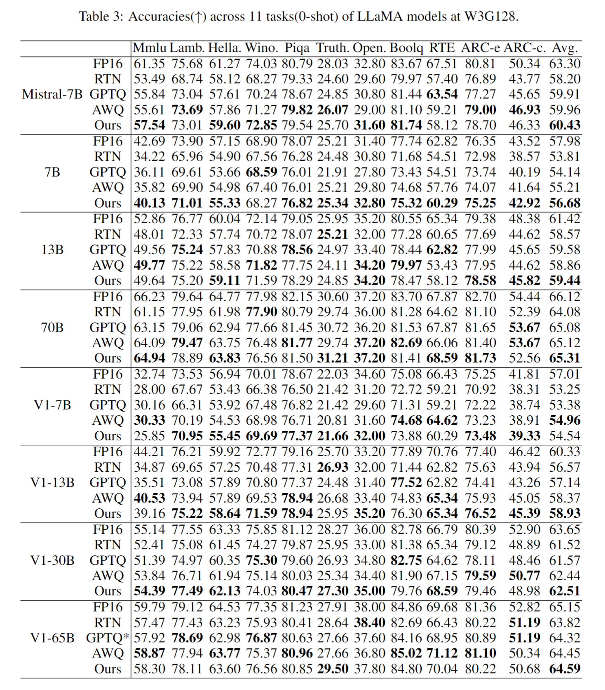

# AutoRound: Advanced Weight-Only Quantization Algorithm for LLMs

AutoRound is an advanced weight-only quantization algorithm, based on SignRound. It's tailored for a wide range of models and consistently delivers noticeable improvements, often significantly outperforming SignRound. However, it comes at the cost of approximately 2.5 times the tuning runtime,e.g., it requires 4.3 hours to quantize LLaMA2-70B on A100.

## Prerequisites
- Python 3.9 or higher

## Installation
Install the necessary dependencies with the following command:
```bash
pip install -r requirements.txt
```
## Usage
```python
from transformers import AutoModelForCausalLM, AutoTokenizer
from auto_round import AutoRound

model_name = "facebook/opt-125m"
model = AutoModelForCausalLM.from_pretrained(
            model_name, low_cpu_mem_usage=True, torch_dtype="auto", trust_remote_code=True
        )
tokenizer = AutoTokenizer.from_pretrained(model_name, trust_remote_code=True)

autoround = AutoRound(model, tokenizer, bits=4, group_size=128, scheme="asym")
fake_qdq_model,weight_config = autoround.quantize() ##scale,zp info are saved in weight config dict

## export to gpu
## please install autogptq first
# packed_folder = "./tmp_autoround_packed"
# autoround.export_to_autogptq(packed_folder, use_triton=True) ## Utilizing Triton for 2-bit and 4-bit scenarios

```
### Detailed Hyperparameters
- `model`: The PyTorch model to be quantized.
- `tokenizer`: An optional tokenizer for processing input data. If none is provided, a dataloader must be supplied.
- `bits (int)`: Number of bits for quantization (default is 4).
- `group_size (int)`: Size of the quantization group (default is 128).
- `scheme (str)`: The quantization scheme (symmetric/asymmetric) to be used (default is "asymmetric").
- `use_quant_input (bool)`: Whether to use the output of the previous quantized block as the input for the current block (default is True).
- `enable_minmax_tuning (bool)`: Whether to enable weight min-max tuning (default is True).
- `iters (int)`: Number of tuning iterations (default is 200).
- `lr (float)`: The learning rate for rounding value (default is None, it will be set to 1.0/iters automatically).
- `minmax_lr (float)`: The learning rate for min-max tuning (default is None, it will be set to lr automatically).
- `n_samples (int)`: Number of samples for tuning (default is 512).
- `seqlen (int)`: Data length of the sequence for tuning.
- `bs (int)`: Batch size for training (default is 8).
- `amp (bool)`: Whether to use automatic mixed precision (default is True).
- `n_blocks (int)`: Packing several blocks as one for tuning together (default is 1).
- `gradient_accumulate_steps (int)`: Number of gradient accumulation steps (default is 1).
- `low_gpu_mem_usage (bool)`: Whether to save GPU memory at the cost of a little tuning time (default is True).
- `dataset_name (str)`: The default dataset name for tuning (default is "NeelNanda/pile-10k").
- `dataset_split (str)`: The split of the dataset to be used for tuning (default is "train").
- `dataloader`: The dataloader for tuning data.
- `weight_config (dict)`: Configuration for weight quantization (default is an empty dictionary), mainly for mixed bits or mixed precision.
- `device`: The device to be used for tuning (default is "cuda:0").


## Tips
Consider increasing tuning steps and adjusting the learning rate based on a scaling law to achieve better results, albeit with increased tuning time. For instance, at step 800, a learning rate of 0.00125 could be employed.


## Known Issues
CPU kernel will be supported soon

Random issues in tuning Qwen models. ChatGlm-V1 is not supported


## Validated Models


| W4G128                                          | MMLU  | Lamb. | Hella. | Wino. | Piqa  | Truth. | Open. | Boolq | RTE   | ARC-e | ARC-c. | AVG.  |
|-------------------------------------------------|-------|-------|--------|-------|-------|--------|-------|-------|-------|-------|--------|-------|
| mistralai/Mixtral-8x7B-v0.1 BF16                | 69.83 | 78.44 | 64.89  | 76.40 | 82.43 | 34.15  | 35.40 | 84.98 | 71.12 | 84.22 | 56.91  | 67.16 |
| mistralai/Mixtral-8x7B-v0.1   AutoRound         | 68.90 | 78.11 | 64.31  | 74.27 | 82.10 | 30.97  | 34.20 | 84.57 | 67.87 | 83.96 | 56.57  | 65.98 |
| mistralai/Mixtral-8x7B-v0.1  AutoRound  iter800 | 68.84 | 77.99 | 64.18  | 75.30 | 81.82 | 31.21  | 35.80 | 85.41 | 68.95 | 83.75 | 55.38  | 66.24 |
| microsoft/phi-2    FP16                         | 56.40 | 62.78 | 55.83  | 75.77 | 78.67 | 31.21  | 40.40 | 83.36 | 62.45 | 80.05 | 52.90  | 61.80 |
| microsoft/phi-2    AutoRound                  | 54.57 | 61.32 | 55.04  | 76.48 | 78.89 | 29.74  | 40.60 | 83.24 | 66.43 | 79.76 | 52.30  | 61.67 |


For a fair comparison, we utilized 512 samples from Pile-10k for all methods during calibration. Due to memory constraints, we maintained the original sequence length of 512 for AWQ, while for GPTQ and our approach,  a sequence length of 2048 is used. We have enalbed act-order and true-seqential in GPTQ, and the notation GPTQ* indicates that we adjusted the random seed or data preprocessing to address issues related to the non-positive definite Hessian matrix or other issues.





### Modes passed smoke test
LaMini-GPT-124M; QWEN1-8B; OPT-125M; Bloom-560m;falcon-7b;gpt-leo-125m;stablelm-base-alpha-3b;dolly-v2-3b;mpt-7b;gpt-j-6b;chatglm2-6b


### Examples
cd to examples folder, install lm-eval to run the evaluation
```bash
pip install -r requirements.txt
```

- **Default Settings:**
```bash
CUDA_VISIBLE_DEVICES=0 python3 main.py --model_name facebook/opt-125m --amp --bits 4 --group_size -1 --enable_minmax_tuning --use_quant_input
```
- **Reduced GPU Memory Usage and Adjusted Training Batch Size:**
```bash
CUDA_VISIBLE_DEVICES=0 python3 main.py --model_name facebook/opt-125m --amp --bits 4 --group_size -1 --low_gpu_mem_usage --train_bs 1 --gradient_accumulate_steps 8
```
- **Utilizing the AdamW Optimizer:**
Include the flag `--adam`. Note that AdamW is less effective than Sign gradient descent in many scenarios we tested.

- **Running the Original SignRound:**
```bash
CUDA_VISIBLE_DEVICES=0 python3 main.py --model_name facebook/opt-125m --amp --bits 4 --group_size -1 --iters 400 --lr 0.0025 --minmax_lr 0.0025
```
 `--enable_minmax_tuning` is strongly recommended 

- The transformers version required varies across different types of models. Here, the transformers version used for running models during experiments is provided as a reference.
- 
    | Model | Transformers version |
    |  :----: | :----: |
    | EleutherAI/gpt-j-6b | 4.28/4.30/4.34/4.36 |
    | huggyllama/llama-7b | 4.28/4.30/4.34/4.36 |
    | meta-llama/Llama-2-7b-hf | 4.30/4.34/4.36 |
    | facebook/opt-6.7b | 4.28/4.30/4.34/4.36 |
    | tiiuae/falcon-7b | 4.28/4.30/4.34/4.36 |
    | mosaicml/mpt-7b | 4.28/4.30/4.34/4.36 |
    | bigscience/bloom-7b1 | 4.28/4.30/4.34/4.36 |
    | baichuan-inc/Baichuan-7B | 4.28/4.30 |
    | Qwen/Qwen-7B | 4.28/4.30/4.34/4.36 |
    | THUDM/chatglm3-6b | 4.34/4.36 |
    | mistralai/Mistral-7B-v0.1 | 4.34/4.36 |
    


## Reference
If you find SignRound useful for your research, please cite our paper:
```bash
@article{cheng2023optimize,
  title={Optimize Weight Rounding via Signed Gradient Descent for the Quantization of LLMs},
  author={Cheng, Wenhua and Zhang, Weiwei and Shen, Haihao and Cai, Yiyang and He, Xin and Lv, Kaokao},
  journal={arXiv preprint arXiv:2309.05516},
  year={2023}
}
```

