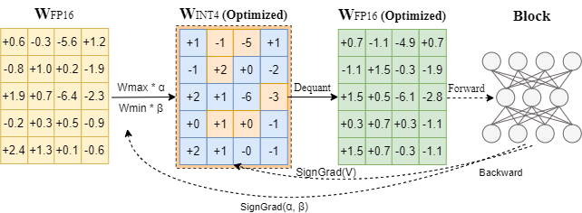

<div align="center">


<p align="center">
  
</p>


<h3> Advanced Quantization Algorithm for LLMs</h3>

[](https://github.com/intel/auto-round)
[](https://github.com/intel/auto-round)
[](https://github.com/intel/auto-round/blob/main/LICENSE)
<a href="https://huggingface.co/Intel">

</a>
---
<div align="left">

## 🚀 What is AutoRound?

AutoRound is an advanced quantization toolkit designed for Large Language Models (LLMs) and Vision-Language Models (VLMs). 
It achieves high accuracy at ultra-low bit widths (2–4 bits) with minimal tuning by leveraging sign-gradient descent and providing broad hardware compatibility. 
See our [paper](https://arxiv.org/pdf/2309.05516) for more details. For usage instructions, please refer to the [User Guide](./docs/step_by_step.md).

<p align="center">
  
</p>


## 🆕 What's New
* [2025/12] [AutoRoundV2 paper](http://arxiv.org/abs/2512.04746) is public at arxiv, please use `AutoScheme` API for mixed precision quantization and use 'enable_alg_ext' to reproduce the resutls.
* 
* [2025/11] AutoRound has landed in **LLM-Compressor**: [*Usage*](https://github.com/vllm-project/llm-compressor/tree/main/examples/autoround/README.md).

* [2025/11] An **enhanced GGUF** quantization algorithm is available via `--enable_alg_ext`: [*Accuracy*](./docs/gguf_alg_ext_acc.md).

* [2025/10] AutoRound has been integrated into **SGLang**: [*Usage*](), [*LMSYS Blog*](https://lmsys.org/blog/2025-11-13-AutoRound/), [*X post*](https://x.com/lmsysorg/status/1991977019220148650?s=20), [*Linkedin*](https://www.linkedin.com/feed/update/urn:li:activity:7397742859354857472).

* [2025/10] A **mix precision** algorithm is available to generate schemes in minutes: [*Usage*](https://github.com/intel/auto-round/blob/main/docs/step_by_step.md#autoscheme),  [*Accuracy*](./docs/auto_scheme_acc.md).

* [2025/09] **MXFP4** and **NVFP4** dtypes is available: [*Accuracy*](./docs/mxnv_acc.md).

* [2025/08] An **improved INT2** algorithm is available via `--enable_alg_ext`: [*Accuracy*](./docs/alg_202508.md)

* [2025/07] **GGUF** format is supported: [*Usage*](./docs/step_by_step.md#gguf-format). 

* [2025/05] AutoRound has been integrated into **vLLM**: [*Usage*](https://docs.vllm.ai/en/latest/features/quantization/auto_round/), [*Blog*](https://medium.com/@NeuralCompressor/accelerating-vllm-and-sglang-deployment-using-autoround-45fdc0b2683e).

* [2025/05] AutoRound has been integrated into **Transformers**: [*Blog*](https://huggingface.co/blog/autoround).

* [2025/03] The INT2-mixed **DeepSeek-R1** model (~200GB) retains 97.9% accuracy: [*Model*]((https://huggingface.co/OPEA/DeepSeek-R1-int2-mixed-sym-inc)).


## ✨ Key Features


✅ **Superior Accuracy**
Delivers strong performance even at 2–3 bits [example models](https://huggingface.co/collections/OPEA/2-3-bits-67a5f0bc6b49d73c01b4753b), with leading results at 4 bits [benchmark](https://huggingface.co/spaces/Intel/low_bit_open_llm_leaderboard).

✅ **Ecosystem Integration**
Seamlessly works with **Transformers, vLLM, SGLang** and more.

✅ **Multiple Formats Export**
Support **AutoRound, AutoAWQ, AutoGPTQ, and GGUF** for maximum compatibility. Details are shown in [export formats](https://github.com/intel/auto-round/blob/main/docs/step_by_step.md#supported-export-formats)

✅ **Fast Mixed Bits/Dtypes Scheme Generation**
Automatically configure in minutes, with about 1.1X-1.5X the model’s BF16 RAM size as overhead. Accuracy [results](./docs/auto_scheme_acc.md) and [user guide](https://github.com/intel/auto-round/blob/main/docs/step_by_step.md#autoscheme).

✅ **Optimized Round-to-Nearest Mode**
Use `--iters 0` for fast quantization with some accuracy drop for 4 bits. Details are shown in [opt_rtn mode](https://github.com/intel/auto-round/blob/main/docs/step_by_step.md#opt-rtn-mode)

✅ **Affordable Quantization Cost**
Quantize 7B models in about 10 minutes on a single GPU. Details are shown in [quantization costs](https://github.com/intel/auto-round/blob/main/docs/step_by_step.md#quantization-costs)

✅ **10+ VLMs Support**
Out-of-the-box quantization for 10+ vision-language models [example models](https://huggingface.co/collections/OPEA/vlms-autoround-675bc712fdd6a55ebaf11bfa), [support matrix](https://github.com/intel/auto-round/tree/main/auto_round/mllm#support-matrix)

✅ **Multiple Recipes**
Choose from `auto-round-best`, `auto-round`, and `auto-round-light` to suit your needs. Details are shown in [quantization recipes](https://github.com/intel/auto-round/blob/main/docs/step_by_step.md#recipe-recommendation)

✅ Advanced Utilities
Includes [multiple gpus quantization](https://github.com/intel/auto-round/blob/main/docs/step_by_step.md#devicemulti-gpu-setting-in-quantization), [multiple calibration datasets](https://github.com/intel/auto-round/blob/main/docs/step_by_step.md#default-dataset) and support for [10+ runtime backends](https://github.com/intel/auto-round/blob/main/docs/step_by_step.md#specify-inference-backend).

✅ Beyond weight only quantization. We are actively expanding support for additional datatypes such as **MXFP**, NVFP, W8A8, and more.


## Installation

### Install from pypi

```bash
# CPU/Intel GPU/CUDA
pip install auto-round

# HPU
pip install auto-round-lib
```

<details>
  <summary>Build from Source</summary>

  ```bash
  # CPU/Intel GPU/CUDA
  pip install .

  # HPU
  python setup.py install lib
  ```

</details>

## Model Quantization (CPU/Intel GPU/Gaudi/CUDA)

### CLI Usage
The full list of supported arguments is provided by calling `auto-round -h` on the terminal.

> **ModelScope is supported for model downloads, simply set `AR_USE_MODELSCOPE=1`.**

```bash
auto-round \
    --model Qwen/Qwen3-0.6B \
    --scheme "W4A16" \
    --format "auto_round" \
    --output_dir ./tmp_autoround
```


We offer another two recipes, `auto-round-best` and `auto-round-light`, designed for optimal accuracy and improved speed, respectively. Details are as follows.
<details>
  <summary>Other Recipes</summary>

  ```bash
# Best accuracy, 3X slower, low_gpu_mem_usage could save ~20G but ~30% slower
auto-round-best \
    --model Qwen/Qwen3-0.6B \
    --scheme "W4A16" \
    --low_gpu_mem_usage 
  ```

  ```bash
# 2-3X speedup, slight accuracy drop at W4 and larger accuracy drop at W2
auto-round-light \
    --model Qwen/Qwen3-0.6B \
    --scheme "W4A16" 

  ```

  <!-- ```bash
auto-round-fast \
# Fast and low memory, 2-3X speedup, slight accuracy drop at W4G128
    --model Qwen/Qwen3-0.6B \
    --bits 4 \
    --group_size 128 \
  ``` -->

</details>

In conclusion, we recommend using **auto-round for W4A16 and auto-round-best with `enable_alg_ext` for W2A16**. However, you may adjust the
configuration to suit your specific requirements and available resources.

### API Usage

```python
from auto_round import AutoRound

# Load a model (supports FP8/BF16/FP16/FP32)
model_name_or_path = "Qwen/Qwen3-0.6B"

# Available schemes: "W2A16", "W3A16", "W4A16", "W8A16", "NVFP4", "MXFP4" (no real kernels), "GGUF:Q4_K_M", etc.
ar = AutoRound(model_name_or_path, scheme="W4A16")

# Highest accuracy (4–5× slower).
# `low_gpu_mem_usage=True` saves ~20GB VRAM but runs ~30% slower.
# ar = AutoRound(model_name_or_path, nsamples=512, iters=1000, low_gpu_mem_usage=True)

# Faster quantization (2–3× speedup) with slight accuracy drop at W4G128.
# ar = AutoRound(model_name_or_path, nsamples=128, iters=50, lr=5e-3)

# Supported formats: "auto_round" (default), "auto_gptq", "auto_awq", "llm_compressor", "gguf:q4_k_m", etc.
ar.quantize_and_save(output_dir="./qmodel", format="auto_round")
```

<details>
<summary>Important Hyperparameters</summary>

##### Quantization Scheme & Configuration
- **`scheme` (str|dict|AutoScheme)**: The predefined quantization keys, e.g. `W4A16`, `MXFP4`, `NVFP4`, `GGUF:Q4_K_M`. For MXFP4/NVFP4, we recommend exporting to LLM-Compressor format.
- **`bits` (int)**: Number of bits for quantization (default is `None`). If not None, it will override the scheme setting.
- **`group_size` (int)**: Size of the quantization group (default is `None`). If not None, it will override the scheme setting.
- **`sym` (bool)**: Whether to use symmetric quantization (default is `None`). If not None, it will override the scheme setting.
- **`layer_config` (dict)**: Configuration for layer_wise scheme (default is `None`), mainly for customized mixed schemes.

##### Algorithm Settings
- **`enable_alg_ext` (bool)**: [Experimental Feature] Only for `iters>0`. Enable algorithm variants for specific schemes (e.g., MXFP4/W2A16) that could bring notable improvements. Default is `False`.
- **`disable_opt_rtn` (bool)**: Use pure RTN mode for specific schemes (e.g., GGUF and WOQ). Default is `False` (improved RTN enabled).

##### Tuning Process Parameters
- **`iters` (int)**: Number of tuning iterations (default is `200`). Common values: 0 (RTN mode), 50 (with lr=5e-3 recommended), 1000. Higher values increase accuracy but slow down tuning.
- **`lr` (float)**: The learning rate for rounding value (default is `None`). When None, it will be set to `1.0/iters` automatically.
- **`batch_size` (int)**: Batch size for training (default is `8`). 4 is also commonly used.

##### Calibration Dataset
- **`dataset` (str|list|tuple|torch.utils.data.DataLoader)**: The dataset for tuning (default is `"NeelNanda/pile-10k"`). Supports local JSON files and dataset combinations, e.g. `"./tmp.json,NeelNanda/pile-10k:train,mbpp:train+validation+test"`.
- **`nsamples` (int)**: Number of samples for tuning (default is `128`).
- **`seqlen` (int)**: Data length of the sequence for tuning (default is `2048`).

##### Device/Speed Configuration
- **`enable_torch_compile` (bool)**: If no exception is raised, typically we recommend setting it to True for faster quantization with lower resource.
- **`low_gpu_mem_usage` (bool)**: Whether to offload intermediate features to CPU at the cost of ~20% more tuning time (default is `False`).
- **`low_cpu_mem_usage` (bool)**: [Experimental Feature]Whether to enable saving immediately to reduce ram usage (default is `False`).
- **`device_map` (str|dict|int)**: The device to be used for tuning, e.g., `auto`, "cpu"`, `"cuda"`, `"0,1,2"` (default is `'0'`). When using "auto", it will try to use all available GPUs.

</details>

### Adaptive Bits/Dtype Usage 
AutoScheme provides an automatic algorithm to generate adaptive mixed bits/data-type quantization recipes.
Please refer to the [user guide](https://github.com/intel/auto-round/blob/main/docs/step_by_step.md#autoscheme) for more details on AutoScheme.
~~~python
from auto_round import AutoRound, AutoScheme

model_name = "Qwen/Qwen3-8B"
avg_bits = 3.0
scheme = AutoScheme(avg_bits=avg_bits, options=("GGUF:Q2_K_S", "GGUF:Q4_K_S"), ignore_scale_zp_bits=True)
layer_config = {"lm_head": "GGUF:Q6_K"}

# Change iters to 200 for non-GGUF schemes
ar = AutoRound(model=model_name, scheme=scheme, layer_config=layer_config, iters=0)
ar.quantize_and_save()
~~~

<details>
<summary>Important Hyperparameters of AutoScheme</summary>


##### AutoScheme Hyperparameters

- **`avg_bits` (float)**: Target average bit-width for the entire model. Only quantized layers are included in the average bit calculation.  
- **`options` (str | list[str] | list[QuantizationScheme])**: Candidate quantization schemes to choose from. It can be a single comma-separated string (e.g., `"W4A16,W2A16"`), a list of strings (e.g., `["W4A16", "W2A16"]`), or a list of `QuantizationScheme` objects.  
- **`ignore_scale_zp_bits` (bool)**: Only supported in API usage. Determines whether to exclude the bits of scale and zero-point from the average bit-width calculation (default: `False`).  
- **`shared_layers` (Iterable[Iterable[str]], optional)**: Only supported in API usage. Defines groups of layers that share quantization settings.  
- **`batch_size` (int, optional)**: Only supported in API usage. Can be set to `1` to reduce VRAM usage at the expense of longer tuning time.  

</details>

### API Usage for VLMs

If you encounter issues during quantization, try setting iters=0 (to enable RTN) and group_size=32 for better
results.


<details>
  <summary>Click to expand</summary>

**This feature is experimental and may be subject to changes**.

By default, AutoRound only quantize the text module of VLMs and uses `NeelNanda/pile-10k` for calibration. To
quantize the entire model, you can enable `quant_nontext_module` by setting it to True, though support for this feature
is limited. For more information, please refer to the AutoRound [readme](./auto_round/mllm/README.md).

```python
from auto_round import AutoRound

# Load the model
model_name_or_path = "Qwen/Qwen2.5-VL-7B-Instruct"
# Quantize the model
ar = AutoRound(model_name_or_path, scheme="W4A16")
output_dir = "./qmodel"
ar.quantize_and_save(output_dir)
```

</details>


## Model Inference

### vLLM (CPU/Intel GPU/CUDA)
```python
from vllm import LLM, SamplingParams

prompts = [
    "Hello, my name is",
]
sampling_params = SamplingParams(temperature=0.6, top_p=0.95)
model_name = "Intel/DeepSeek-R1-0528-Qwen3-8B-int4-AutoRound"
llm = LLM(model=model_name)

outputs = llm.generate(prompts, sampling_params)

for output in outputs:
    prompt = output.prompt
    generated_text = output.outputs[0].text
    print(f"Prompt: {prompt!r}, Generated text: {generated_text!r}")
```


### SGLang (Intel GPU/CUDA)
**Please note that support for the MoE models and visual language models is currently limited.**

```python
import sglang as sgl

llm = sgl.Engine(model_path="Intel/DeepSeek-R1-0528-Qwen3-8B-int4-AutoRound")
prompts = [
    "Hello, my name is",
]
sampling_params = {"temperature": 0.6, "top_p": 0.95}

outputs = llm.generate(prompts, sampling_params)
for prompt, output in zip(prompts, outputs):
    print(f"Prompt: {prompt}\nGenerated text: {output['text']}")
```


### Transformers (CPU/Intel GPU/Gaudi/CUDA)

AutoRound supports 10+ backends and automatically selects the best available backend based on the installed libraries and prompts the user to
install additional libraries when a better backend is found.

**Please avoid manually moving the quantized model to a different device** (e.g., model.to('cpu')) during inference, as
this may cause unexpected exceptions.

The support for Gaudi device is limited.

```python
from transformers import AutoModelForCausalLM, AutoTokenizer

model_name = "Intel/DeepSeek-R1-0528-Qwen3-8B-int4-AutoRound"
model = AutoModelForCausalLM.from_pretrained(model_name, device_map="auto", torch_dtype="auto")
tokenizer = AutoTokenizer.from_pretrained(model_name)
text = "There is a girl who likes adventure,"
inputs = tokenizer(text, return_tensors="pt").to(model.device)
print(tokenizer.decode(model.generate(**inputs, max_new_tokens=50)[0]))
```

## Acknowledgement
Special thanks to open-source low precision libraries such as AutoGPTQ, AutoAWQ, GPTQModel, Triton, Marlin, and ExLLaMAV2 for providing low-precision CUDA kernels, which are leveraged in AutoRound.

> **Note**:
> For all publications/events, please view [Publication List](./docs/publication_list.md).

## 🌟 Support Us
If you find AutoRound helpful, please ⭐ star the repo and share it with your community!
