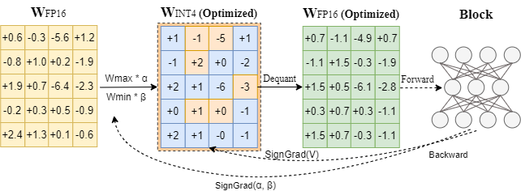

<div align="center">


<p align="center">
  
</p>


<h3> 面向 LLM 的先进量化算法</h3>

[](https://github.com/intel/auto-round)
[](https://github.com/intel/auto-round/releases)
[](https://pypi.org/project/auto-round-nightly)
[](https://github.com/intel/auto-round/blob/main/LICENSE)
<a href="https://huggingface.co/Intel">

</a>

&nbsp;&nbsp;&nbsp;&nbsp;[English](README.md) | 简体中文

[User Guide](./docs/step_by_step.md) | [用户指南](./docs/step_by_step_CN.md)&nbsp;&nbsp; 

---
<div align="left">

## 🚀 AutoRound 是什么？

AutoRound 是专为大语言模型（LLMs）和视觉-语言模型（VLMs）设计的先进量化工具包。它能在 **极低比特（2–4 bits）** 下实现较高的模型精度，所需调参极少。其核心是采用**符号梯度下降法（sign-gradient descent）**。此外，该工具还具备良好的硬件兼容性。更多细节详见论文 [SignRoundV1](https://arxiv.org/pdf/2309.05516) 和 [SignRoundV2](http://arxiv.org/abs/2512.04746)。使用方法请参阅 [用户指南](./docs/step_by_step.md).

<p align="center">
  
</p>


## 🆕 最新进展

* [2025/12] 发布 **SignRoundV2** 论文。如果要复现论文成果，可启用 `enable_alg_ext`，并使用 **AutoScheme** API 对模型进行混合精度量化。相关链接：[*论文*](http://arxiv.org/abs/2512.04746)，[*LLaMA 模型评估说明*](./docs/alg_202508.md)。

* [2025/11] **LLM-Compressor** 已支持 AutoRound 算法。相关链接：[*使用方法*](https://github.com/vllm-project/llm-compressor/tree/main/examples/autoround/README.md)，[*vLLM 博客*](https://blog.vllm.ai/2025/12/09/intel-autoround-llmc.html)，[*RedHat 博客*](https://developers.redhat.com/articles/2025/12/09/advancing-low-bit-quantization-llms-autoround-x-llm-compressor)，[*X 推文*](https://x.com/vllm_project/status/1998710451312771532)，[*Intel 博客*](https://community.intel.com/t5/Blogs/Products-and-Solutions/HPC/Advancing-Low-Bit-Quantization-for-LLMs-AutoRound-x-LLM/post/1729336)，[*LinkedIn*](https://www.linkedin.com/posts/vllm-project_advancing-lowbit-quantization-for-llms-activity-7404478053768441856-ru8f/?utm_source=share&utm_medium=member_desktop&rcm=ACoAAAapNW8BLnAdCAr57GOwSCJXjf76ZvOEOAg)，[*微信*](https://mp.weixin.qq.com/s/l5WA-1_4ipffQN6GOH2Iqg)，[*知乎*](https://zhuanlan.zhihu.com/p/1982167638315664412)。

* [2025/11] 推出 **增强版 GGUF** 量化算法，启用 `--enable_alg_ext` 即可。相关链接：[*Accuracy*](./docs/gguf_alg_ext_acc.md)。

* [2025/10] **SGLang** 已集成 AutoRound。相关链接：[*使用方法*](https://docs.sglang.io/advanced_features/quantization.html#using-auto-round)，[*LMSYS 博客*](https://lmsys.org/blog/2025-11-13-AutoRound/)，[*X 推文*](https://x.com/lmsysorg/status/1991977019220148650?s=20)，[*Intel 博客*](https://community.intel.com/t5/Blogs/Tech-Innovation/Artificial-Intelligence-AI/AutoRound-Meets-SGLang-Enabling-Quantized-Model-Inference-with/post/1727196)，[*LinkedIn*](https://www.linkedin.com/feed/update/urn:li:activity:7397742859354857472)。

* [2025/10] 推出 **混合精度** 算法，可在几分钟内自动生成混合精度方案。相关链接：[*使用方法*](https://github.com/intel/auto-round/blob/main/docs/step_by_step.md#autoscheme)，[*Accuracy*](./docs/auto_scheme_acc.md)。

* [2025/09] 新增对 **MXFP4** 和 **NVFP4** 数据类型的支持。相关链接：[*Accuracy*](./docs/mxnv_acc.md)。

* [2025/08] 提供 **改进版 INT2** 算法，启用 `--enable_alg_ext` 即可。相关链接：[*Accuracy*](./docs/alg_202508.md)。

* [2025/07] 新增 **GGUF** 格式导出。相关链接：[*使用方法*](./docs/step_by_step.md#gguf-format)。

* [2025/05]  **vLLM** 现已集成 AutoRound。相关链接：[*使用方法*](https://docs.vllm.ai/en/latest/features/quantization/auto_round/)，[*Medium 博客*](https://medium.com/@NeuralCompressor/accelerating-vllm-and-sglang-deployment-using-autoround-45fdc0b2683e)，[*小红书*](https://www.xiaohongshu.com/explore/69396bc6000000000d03e473?note_flow_source=wechat&xsec_token=CB6G3F_yM99q8XfusvyRlJqm8Db4Es2k0kYIHdIUiSQ9g=)。

* [2025/05] **Transformers** 已集成 AutoRound。相关链接：[*博客*](https://huggingface.co/blog/autoround)。

* [2025/03] 约 200GB 的 **DeepSeek-R1** 模型经量化（INT2混合精度）后精度仍高达 97.9%。相关链接：[*模型*](https://huggingface.co/OPEA/DeepSeek-R1-int2-mixed-sym-inc)。


## ✨ 核心特性


✅ **模型精度卓越** 在 2–3 bit 的极低精度下，模型也能保持强劲性能（[示例模型](https://huggingface.co/collections/OPEA/2-3-bits-67a5f0bc6b49d73c01b4753b)）；在 4 bit 量化上，模型的[基准测试](https://huggingface.co/spaces/Intel/low_bit_open_llm_leaderboard)成绩也处在领先水平。

✅ **生态集成度好** 与 **Transformers、vLLM、SGLang** 等主流框架无缝衔接。

✅ **导出格式丰富** 支持导出为 ​**AutoRound、AutoAWQ、AutoGPTQ** 及 **GGUF**​ 格式。相关链接：[导出格式](https://github.com/intel/auto-round/blob/main/docs/step_by_step.md#supported-export-formats)

✅ **自动混合精度** 可在几分钟内自动生成混合 bit 策略（但需要额外占用模型在 BF16 格式下内存占用量的 1.1-1.5 倍）。详见：Accuracy [结果](https://github.com/intel/auto-round/blob/main/docs/auto_scheme_acc.md) 和 [用户指南](https://github.com/intel/auto-round/blob/main/docs/step_by_step.md#autoscheme)

✅ **优化的 RTN 模式** 使用 `--iters 0`​ 参数可启用优化的 Round-to-Nears 模式，实现快速量化（但在 4 bit 下准确度会有一定降低）。详见：[opt_rtn 模式](https://github.com/intel/auto-round/blob/main/docs/step_by_step.md#opt-rtn-mode)。

✅ **可接受的量化成本** 在单张 GPU 上量化一个 7B 的模型只需约十分钟。详见：[量化成本](https://github.com/intel/auto-round/blob/main/docs/step_by_step.md#quantization-costs)

✅ **支持十余种 VLM 模型**  已支持十余种视觉语言模型，让用户有“开盖即食”般的量化体验。详见：[示例模型](https://huggingface.co/collections/OPEA/vlms-autoround-675bc712fdd6a55ebaf11bfa)，[支持矩阵](https://github.com/intel/auto-round/tree/main/auto_round/mllm#support-matrix)

✅ **多种量化方案可选**  提供 `auto-round-best`​、`auto-round`​、`auto-round-light`​ 等多种预设方案，能够满足多样化需求。详见：[量化方案](https://github.com/intel/auto-round/blob/main/docs/step_by_step.md#recipe-recommendation)

✅ **实用额外特性** 支持[多 GPU 量化](https://github.com/intel/auto-round/blob/main/docs/step_by_step.md#devicemulti-gpu-setting-in-quantization)和[多标定数据集](https://github.com/intel/auto-round/blob/main/docs/step_by_step.md#default-dataset)，并兼容[十余种推理后端](https://github.com/intel/auto-round/blob/main/docs/step_by_step.md#specify-inference-backend)。

✅ **不局限于权重量化** 我们正积极扩展对 **MXFP、NVFP、W8A8** 等更多数据类型的支持。


## 安装

### 从 PyPI 安装

```shell
# CPU(Xeon)/GPU(CUDA)
pip install auto-round

# CPU(Xeon)/GPU(CUDA) nightly
pip install auto-round-nightly

# HPU(Gaudi)
# 在 hpu docker container 中安装, e.g. vault.habana.ai/gaudi-docker/1.23.0/ubuntu24.04/habanalabs/pytorch-installer-2.9.0:latest  
pip install auto-round-hpu

# XPU(Intel GPU)
pip install torch --index-url https://download.pytorch.org/whl/xpu
pip install auto-round
```

<details>
  <summary>从源码编译安装</summary>

  ```bash
  # CPU(Xeon)/GPU(CUDA)
  pip install .

  # HPU(Gaudi)
  python setup.py install hpu
  
  # XPU(Intel GPU)
  pip install torch --index-url https://download.pytorch.org/whl/xpu
  pip install .
  ```

</details>

## 模型量化（CPU / Intel GPU / Gaudi / CUDA）

### CLI 用法

终端运行 `auto-round -h` 可以查看 auto-round 完整的参数列表。

> **支持通过 ModelScope 下载模型（只需设置** ​**​`AR_USE_MODELSCOPE=1`​** ）。

```shell
auto-round \
    --model Qwen/Qwen3-0.6B \
    --scheme "W4A16" \
    --format "auto_round" \
    --output_dir ./tmp_autoround
```

另外，我们还提供 `auto-round-best`​ 和 `auto-round-light` 两种方案，前者旨在追求更高的模型精度，后者则专注于提升量化速度。具体细节如下：


<details>
  <summary>其他方案</summary>

  ```bash
# 最佳精度，速度慢 3 倍，low_gpu_mem_usage 可节省 ~20G 显存，但会慢 ~30%
auto-round-best \
    --model Qwen/Qwen3-0.6B \
    --scheme "W4A16" \
    --low_gpu_mem_usage
  ```

  ```bash
# 2–3 倍加速，W4 下准确度略降，W2 下准确度下降更明显
auto-round-light \
    --model Qwen/Qwen3-0.6B \
    --scheme "W4A16"
  ```

  <!-- ```bash
auto-round-fast \
# Fast and low memory, 2-3X speedup, slight accuracy drop at W4G128
    --model Qwen/Qwen3-0.6B \
    --bits 4 \
    --group_size 128 \
  ``` -->

</details>

小结：对于 ​**W4A16 量化，我们建议使用默认的 auto-round；而 W2A16 量化我们则推荐启用 ​`enable_alg_ext`​ 参数的 auto-round-best​**。当然，您也可以根据自身需求和手头上的算力灵活调整配置。

### API 用法

```python
from auto_round import AutoRound

# 加载模型（支持 FP8 / BF16 / FP16 / FP32）
model_name_or_path = "Qwen/Qwen3-0.6B"

# 可选量化配置：
# "W2A16", "W3A16", "W4A16", "W8A16", "NVFP4", "MXFP4"（无真实 kernel）, "GGUF:Q4_K_M" 等
ar = AutoRound(model_name_or_path, scheme="W4A16")

# 追求高模型精度（速度会慢 4–5 倍）
# `low_gpu_mem_usage=True` 可节省 ~20GB 显存，但会慢 ~30%
# ar = AutoRound(model_name_or_path, nsamples=512, iters=1000, low_gpu_mem_usage=True)

# 追求量化速度（提速 2–3 倍），但在 W4G128 下精度会略微下降
# ar = AutoRound(model_name_or_path, nsamples=128, iters=50, lr=5e-3)

# 支持的导出格式："auto_round"（默认）, "auto_gptq", "auto_awq", "llm_compressor", "gguf:q4_k_m" 等
ar.quantize_and_save(output_dir="./qmodel", format="auto_round")
```

<details>
<summary>核心超参数</summary>

##### 量化方案 & 配置

- ​**​`scheme`​**​（str | dict | AutoScheme）：预定义的如 `W4A16`​、`MXFP4`​、`NVFP4`​、`GGUF:Q4_K_M`等量化配置标识。其中对于 MXFP4/NVFP4 方案，我们推荐导出为 LLM-Compressor 格式。
- ​**​`bits`​**​（int）：量化目标精度（默认值为 `None`）。若指定此参数，将覆盖 scheme 中的设置。
- ​**​`group_size`​**​（int）：量化分组大小（默认值为 `None`）。若指定此参数，将覆盖 scheme 中的设置。
- ​**​`sym`​**​（bool）：是否使用对称量化（默认值为 `None`）。若指定此参数，将覆盖 scheme 中的设置。
- ​**​`layer_config`​**​（dict）：层级自定义配置（默认值为 `None`）。主要用于自定义混合化方案，可以对每一层设置专门的量化参数。

##### 算法相关设置

- ​**​`enable_alg_ext`​**​（bool）：[实验性功能] 仅在 `iters > 0`​ 时生效。在特定 scheme（如 MXFP4 / W2A16）下启用算法扩展，可显著提升量化效果。默认值为 `False`。
- ​**​`disable_opt_rtn`​**​（bool | None）：是否对特定方案（如 GGUF 与权重量化方案）禁用优化的 RTN 模式。优化的 RTN 模式需要标定数据和更多的算力来提升精度。默认值为 `None`：在大多数情况下，为提升精度，算法会自动采用优化的 RTN 模式（即 `False`）；仅在已知存在兼容性问题时，才会自动禁用（即 `True`）


##### 训练参数

- ​**​`iters`​**​（int）：训练迭代次数（tuning iterations）（默认值为 `200`​）。常用取值：0（RTN 模式）、50（推荐搭配 `lr=5e-3`）、1000（更高精度但量化速度慢）。也就是说迭代次数越多，准确度越高，但速度越慢。
- ​**​`lr`​**​（float）：舍入值（rounding rate）的学习率（默认值为 `None`​）。当为 None 时，将自动设为 `1.0/iters`。
- ​**​`batch_size`​**​（int）：训练批次大小（batch size）。默认为 `8`​，也常用 `4`。
- ​**​`enable_deterministic_algorithms`​**​（bool）：若想保证结果可以复现，可以设为 `True` 来启用确定性算法（默认 `False`）。

##### 标定数据集

- ​**​`dataset`​**​（str | list | tuple | DataLoader）：量化中用于校准的数据集（默认 `"NeelNanda/pile-10k"`​）。支持本地 JSON 文件和数据集组合使用，如 `"./tmp.json,NeelNanda/pile-10k:train,mbpp:train+validation+test"`。
- ​**​`nsamples`​**​（int）：校准时使用的样本数（默认 `128`）。
- ​**​`seqlen`​**​（int）：每条样本在校准时使用 token 的序列长度（默认 `2048`）。

##### 设备 / 速度配置

- ​**​`enable_torch_compile`​**（bool）：通常建议设为 `True` 来提升量化速度、降低资源消耗，但是有极小概率会触发异常，建议使用最新的 tiron 版本。
- ​**​`low_gpu_mem_usage`​**​（bool）：若要节省显存，可以设为 `True` 。它会将中间特征卸载到 CPU，但会增加 20% 的时间（默认 `False`）。
- ​**​`low_cpu_mem_usage`​**​（bool）：[实验性功能] 若要减少内存占用，可以设为 `True` 来启用即时保存（默认 `False`）。
- ​**​`device_map`​**​（str | dict | int）：计算设备指定，如 `auto`​、`cpu`​、`cuda`​、`0,1,2`​（默认 `0`​）。使用 `auto` 时会尝试利用所有可用 GPU。

</details>

### 支持的量化方案
<details>
<summary>详细说明</summary>
可以看到有些 schemes 为灰色背景，这通常表示它没有专门优化的内核，或只有效率极低的参考内核。
其中， BF16 主要适用于 AutoScheme（其他方案一般不用）。

|格式| 支持的scheme                                                                                                                                                                                       |
| ------|-------------------------------------------------------------------------------------------------------------------------------------------------------------------------------------------------|
|**auto_round**| W4A16（推荐）、W2A16、W3A16、W8A16、W2A16G64、W2A16G32、`MXFP4`​、`MXFP8`​、`MXFP4_RCEIL`​、`MXFP8_RCEIL`​、`NVFP4`​、`FPW8A16`​、`FP8_STATIC`​、`BF16`                                                          |
|**auto_awq**| W4A16（推荐）、BF16                                                                                                                                                                                  |
|**auto_gptq**| W4A16（推荐）、W2A16、W3A16、W8A16、W2A16G64、W2A16G32、BF16                                                                                                                                              |
|**llm_compressor**| NVFP4（推荐）、`MXFP4`​、`MXFP8`​、`FPW8A16`​、`FP8_STATIC`                                                                                                                                             |
|**gguf**| GGUF:Q4\_K\_M（推荐）、Auto-RoundGGUF:Q2\_K\_S、GGUF:Q3\_K\_S、GGUF:Q3\_K\_M、GGUF:Q3\_K\_L、GGUF:Q4\_K\_S、GGUF:Q5\_K\_S、GGUF:Q5\_K\_M、GGUF:Q6\_K、GGUF:Q4\_0、GGUF:Q4\_1、GGUF:Q5\_0、GGUF:Q5\_1、GGUF:Q8\_0 |
|**fake**| ​`所有方案（仅用于研究）`                                                                                                                                                                                  |
</details>

### 自适应量化方案（AutoScheme）（实验性功能）

AutoScheme 提供了一种自动生成算法，用于生成 **自适应的混合精度/数据类型** 的量化方案（mixed bits/data type quantization recipes）。关于 AutoScheme 的更多细节可参考[用户指南](https://github.com/intel/auto-round/blob/main/docs/step_by_step.md#autoscheme)。

```python
from auto_round import AutoRound, AutoScheme

model_name = "Qwen/Qwen3-8B"
avg_bits = 3.0
scheme = AutoScheme(avg_bits=avg_bits, options=("GGUF:Q2_K_S", "GGUF:Q4_K_S"), ignore_scale_zp_bits=True)
layer_config = {"lm_head": "GGUF:Q6_K"}

# 对于非 GGUF 方案，将 iters 改为 200
ar = AutoRound(model=model_name, scheme=scheme, layer_config=layer_config, iters=0)
ar.quantize_and_save()
```

<details>
<summary>AutoScheme 核心超参数说明</summary>

##### AutoScheme 超参数

- ​**​`avg_bits`​**​  **(float)** ：整个模型的目标平均 bits（平均 bits 的计算仅包含被量化的层）。
- ​**​`options`​**​  **(str | list[str] | list[QuantizationScheme])** ​：候选量化配置集合。支持以下表示形式：单个用逗号分隔的字符串（例如 `"W4A16,W2A16"`​）、字符串列表（例如 `["W4A16", "W2A16"]`​）和 `QuantizationScheme` 。
- ​**​`ignore_scale_zp_bits`​**​  **(bool)** ​：仅支持 API 调用场景。用于决定在计算平均 bit 时，是否忽略 scale 与 zero-point 的位数（默认 `False`）。
- ​**​`shared_layers`​**​  **(Iterable[Iterable[str]], optional)** ：仅支持 API 调用场景，用于定义多个层的分组，这些层将共享相同的量化配置。
- ​**​`batch_size`​**​  **(int, optional)** ​：仅支持 API 调用场景。设为 `1` 可以降低显存占用，但同时会增加训练时间。

</details>

### 视觉语言模型（VLM）的 API 调用方法

如果在量化过程中遇到问题可尝试启动 RTN 模式，具体是指将 `iters` 设置为 `0` 并打开 `disable_opt_rtn`。另外可以将 `group_size` 设为 `32` 可以提升RTN模型的精度，副作用是有一定的性能下降。


<details>
  <summary>点击展开</summary>

**该功能仍在实验阶段**

默认情况下，AutoRound 只会量化 VLM 的文本模块，并默认采用 `NeelNanda/pile-10k`​ 作为标定数据集。若需量化整个模型，可设置 `quant_nontext_module = True` （但目前为止该功能的适用范围仍较为有限）。更多信息请参考 [readme](./auto_round/mllm/README.md)

```python
from auto_round import AutoRound

# 加载模型
model_name_or_path = "Qwen/Qwen2.5-VL-7B-Instruct"
# 量化模型
ar = AutoRound(model_name_or_path, scheme="W4A16")
output_dir = "./qmodel"
ar.quantize_and_save(output_dir)
```

</details>


## 模型推理

### vLLM（CPU / Intel GPU / CUDA）

```python
from vllm import LLM, SamplingParams

prompts = [
    "Hello, my name is",
]
sampling_params = SamplingParams(temperature=0.6, top_p=0.95)
model_name = "Intel/DeepSeek-R1-0528-Qwen3-8B-int4-AutoRound"
llm = LLM(model=model_name)

outputs = llm.generate(prompts, sampling_params)

for output in outputs:
    prompt = output.prompt
    generated_text = output.outputs[0].text
    print(f"Prompt: {prompt!r}, Generated text: {generated_text!r}")
```

### SGLang（Intel GPU / CUDA）

**注意：目前对混合专家模型（MoE）模型和视觉语言（VLM）模型的支持尚不完善。**

```python
import sglang as sgl

llm = sgl.Engine(model_path="Intel/DeepSeek-R1-0528-Qwen3-8B-int4-AutoRound")
prompts = [
    "Hello, my name is",
]
sampling_params = {"temperature": 0.6, "top_p": 0.95}

outputs = llm.generate(prompts, sampling_params)
for prompt, output in zip(prompts, outputs):
    print(f"Prompt: {prompt}\nGenerated text: {output['text']}")
```

### Transformers（CPU / Intel GPU / Gaudi / CUDA）

AutoRound 支持十余种推理后端，并会根据已安装的库自动选择最优后端；如果检测到系统中存在更优后端但缺少相关依赖，也会主动提示用户安装。

​**请勿在推理过程中手动将量化后的模型迁移到其他设备**​（例如执行 `model.to('cpu')`），否则可能导致意外错误。

目前对 Gaudi 设备的支持尚不完善。

```python
from transformers import AutoModelForCausalLM, AutoTokenizer

model_name = "Intel/DeepSeek-R1-0528-Qwen3-8B-int4-AutoRound"
model = AutoModelForCausalLM.from_pretrained(model_name, device_map="auto", torch_dtype="auto")
tokenizer = AutoTokenizer.from_pretrained(model_name)
text = "There is a girl who likes adventure,"
inputs = tokenizer(text, return_tensors="pt").to(model.device)
print(tokenizer.decode(model.generate(**inputs, max_new_tokens=50)[0]))
```

## 研究成果 & 其他活动

[SignRoundV2: Closing the Performance Gap in Extremely Low-Bit Post-Training Quantization for LLMs](https://arxiv.org/abs/2512.04746)（202512 论文）

[Optimize Weight Rounding via Signed Gradient Descent for the Quantization of LLM](https://aclanthology.org/2024.findings-emnlp.662/)（202309 论文）

[TEQ: Trainable Equivalent Transformation for Quantization of LLMs](https://arxiv.org/abs/2310.10944)（202310 论文）

[Effective Post-Training Quantization for Large Language Models](https://medium.com/intel-analytics-software/effective-post-training-quantization-for-large-language-models-with-enhanced-smoothquant-approach-93e9d104fb98)（202304 博客）

更多内容请查看 [完整论文列表](./docs/publication_list.md).

## 致谢

特别感谢 AutoGPTQ、AutoAWQ、GPTQModel、Triton、Marlin、ExLLaMAV2 等开源低精度库，它们提供的低精度 CUDA 内核（low-precision CUDA kernel）为 AutoRound 的实现提供了重要支持。

## 🌟 支持我们

如果觉得 AutoRound 对你有帮助，欢迎给 repo 点个 ⭐ 并转发到你的社区~
