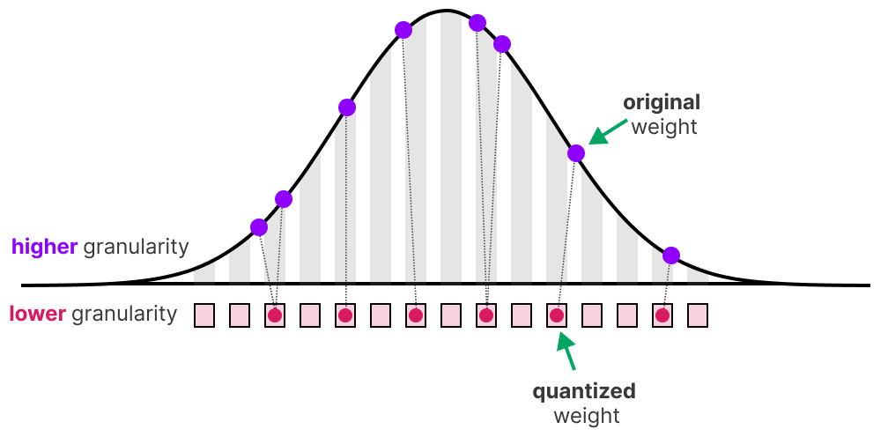

# AutoRound for the vLLM Community — Detailed Slide Content

> Based on outline: `auto-round-vllm-v1.md`
> Figures and videos are placeholders — add them later.
> [P] refer to the placeholders - add them later
---

## Title Slide

**Making Low-Bit LLM/VLM Quantization Practical in vLLM/vLLM-Omni with AutoRound**

- **Speaker:** [Yi, Liu], Software Engineer @ Intel — AutoRound Team
- **Venue:** vLLM Community Sharing
- **Duration:** ~70 min talk + Q&A

> **Presenter note:** This talk is for two audiences: senior inference engineers who care about production tradeoffs, and practitioners who need a clean mental model of quantization. Keep the flow from fundamentals → algorithm → deployment → community.

---

---

# Part 1: Quantization Basics

**Estimated time: 15 minutes**
**Goal:** Build a shared mental model of quantization before introducing AutoRound.

---

## Slide 1.1 — What Is Quantization?

### The Core Idea

Quantization maps continuous floating-point values to a discrete set of integer values, reducing the number of bits needed to represent each weight or activation.

```
FP16 weight:  [0.234, -0.891, 1.203, -0.045, ...]   ← 16 bits per value
      ↓  quantize
INT4 weight:  [  3,    -7,     7,    -1,   ...]      ← 4 bits per value
```



**[ PLACEHOLDER: Figure — Visual showing continuous FP values being mapped to discrete INT buckets ]**

---

## Slide 1.2 — Core Quantization Concepts

### The Quantization Formula

For uniform affine quantization:

```
scale = (x_float_max - x_float_min) / (2^n - 1)
x_quant = round((x_float - zero_point) / scale)
x_dequant = x_quant * scale + zero_point
```

### Four Key Concepts

**1. Scale (Δ)**
- The step size between adjacent quantized values
- `scale = (max - min) / (2^n - 1)`
- Larger scale → wider range but coarser steps
- Smaller scale → finer steps but narrower range

**2. Zero Point (Z)**
- The integer value that maps to floating-point zero
- Ensures zero is exactly representable (critical for padding, ReLU, etc.)
- Symmetric quantization: zero_point = 0 (simpler, used in most LLM weight quantization)
- Asymmetric quantization: zero_point ≠ 0 (better for activations with non-symmetric distributions)

**3. Rounding**
- Maps a floating-point value to the nearest integer in the quantized domain
- Standard: round-to-nearest (RTN)
- AutoRound's key insight: **learned rounding** — sometimes rounding up instead of down preserves more information

**4. Quantization Error**
- The difference between the original value and the dequantized value
- `error = x_float - x_dequant`
- Measured as MSE, MAE, or task-specific accuracy drop
- Not all errors are equal — some weights matter more than others

**5. An real Example**
[Place Holder]

**[ PLACEHOLDER: Animation — Interactive demo of scale, zero_point, and rounding with a toy vector ]**


---

## Slide 1.3 — Quantization Primitives

### Data Types
Compare the Exponent, and Mantissa
- INT8/FP8
- INT4/FP4
### Quantization Granularity
- Per-tensor
- Per-channel
- Per-group
- Per-token

---

## Slide 1.7 — PTQ vs. QAT

### Two Approaches to Quantization

| | PTQ (Post-Training Quantization) | QAT (Quantization-Aware Training) |
|---|---|---|
| **When** | After training | During training |
| **Data needed** | Small calibration set (128–512 samples) | Large calibration set|
| **Compute cost** | Minutes to hours on 1 GPU | Hours to days on many GPUs |
| **Access needed** | Model weights only | Full training pipeline |
| **Accuracy** | Good (with advanced PTQ) | Best possible |


## Slide 1.4 — Why Quantization Is Necessary for LLM/VLM Serving

### The Hardware Reality

Compare the memory transformation and TFLOPs between BF16 GEMM and INT4 GEMM

Modern GPU hardware has a fundamental asymmetry:

| Operation | FP16 | INT8 | INT4 | Ratio |
|-----------|------|------|------|-------|
| Compute (TFLOPS) | baseline | 1.5–2× | 2–4× | INT is faster |
| Memory bandwidth (GB/s) | baseline | 2× | 4× | Fewer bits = less data |
| Memory capacity (GB) | baseline | 2× | 4× | Smaller model footprint |

### Why This Matters for LLM Serving
[P]


---


## Slide 1.8 — Quantization in vLLM: Architecture View

### Where Quantization Fits in the vLLM Stack

```
┌─────────────────────────────────────────────────────────────┐
│                      vLLM Serving Stack                       │
│                                                               │
│  ┌─────────────────────────────────────────────────────────┐ │
│  │  API Server / OpenAI-compatible endpoint                 │ │
│  ├─────────────────────────────────────────────────────────┤ │
│  │  Scheduler (PagedAttention, prefix caching, chunked prefill) │
│  ├─────────────────────────────────────────────────────────┤ │
│  │  Model Runner (model execution, KV cache management)    │ │
│  ├─────────────────────────────────────────────────────────┤ │
│  │  Model Executor                                           │ │
│  │  ┌─────────────────────────────────────────────────────┐ │ │
│  │  │  Layer dispatch                                      │ │ │
│  │  │  ┌─────────────────────────────────────────────────┐ │ │ │
│  │  │  │  Quantization Layer  ← AutoRound integrates here │ │ │ │
│  │  │  │  • QuantMethod dispatch (linear, MoE, KV cache)  │ │ │ │
│  │  │  │  • Packed → unpacked weight conversion            │ │ │ │
│  │  │  │  • Kernel selection (Marlin, Triton, Torch, ...)  │ │ │ │
│  │  │  └─────────────────────────────────────────────────┘ │ │ │
│  │  └─────────────────────────────────────────────────────┘ │ │
│  ├─────────────────────────────────────────────────────────┤ │
│  │  Worker / Ray distributed execution                      │ │
│  ├─────────────────────────────────────────────────────────┤ │
│  │  Hardware (CUDA, XPU, HPU, CPU, MPS)                     │ │
│  └─────────────────────────────────────────────────────────┘ │
└─────────────────────────────────────────────────────────────┘
```

### The Quantization Callstack (Based on the trace results)
[P]

```


# Part 2: AutoRound Introduction and Practice

**Estimated time: 20 minutes**
**Goal:** Explain why AutoRound maintains good accuracy at low bit-widths and why it's practical for deployment.

---

## Slide 2.1 — The Core Problem: Why Low-Bit Quantization Is Hard


### Three Sources of Quantization Error

**1. Rounding Error**
- Rounding `5.2` to `5` (INT4 scale=1) vs rounding `0.1` to `0`
- Both are "correct" rounding, but the former loses much more information

**2. Clipping Error**
- Setting `max = 5.0` clips the outlier `5.2` → `5.0`
- Setting `max = 6.0` includes the outlier but wastes precision on the unused range `[5.2, 6.0]`
- Finding the optimal clipping range is non-trivial

**3. Outlier Amplification**
- A few large-magnitude weights (outliers) force a large scale → most weights get coarse quantization
- This is the core difficulty of low-bit (2-4 bit) quantization


> **Key message:** The hardest part of low-bit quantization is deciding which weights to round up vs. down, and where to set the clipping range. AutoRound optimizes both simultaneously.

**[ PLACEHOLDER: Figure — Visual showing quantization error from rounding vs. clipping on a weight distribution ]**

---

## Slide 2.2 — AutoRound Algorithm: The Big Picture

### The Key Insight

> **Quantization is a discrete optimization problem — we can use gradient-based optimization if we make the rounding decision differentiable.**


### What AutoRound Optimizes

Two trainable parameter sets per weight matrix:

| Parameter | Shape | What it controls | Initial value |
|-----------|-------|------------------|---------------|
| **v** (rounding) | same as W | Whether each weight rounds up or down | 0 (round-to-nearest) |
| **min, max** (clipping) | scalar per group | The quantization range [min, max] | min(W), max(W) |

The actual quantization during tuning:
```
W_quant = clamp(round(W/scale + v), min_int, max_int)  ← v biases the round
W_dequant = W_quant * scale                              ← scale derived from [min, max]
```

### Algorithm Flow

```
┌─────────────────────────────────────────────────────────────┐
│                    AutoRound Algorithm                        │
│                                                               │
│  Input: FP16 model, calibration data, bit-width, group_size   │
│                                                               │
│  For each transformer block:                                  │
│    ┌─────────────────────────────────────────────────────┐   │
│    │ 1. Wrap linear layers with QDQ (Quantize-DeQuantize) │   │
│    │    • Insert trainable rounding parameter v            │   │
│    │    • Insert trainable clipping range [min, max]       │   │
│    ├─────────────────────────────────────────────────────┤   │
│    │ 2. Forward calibration data through the block        │   │
│    │    • Compute quantized output                         │   │
│    │    • Compute MSE loss vs. FP16 reference output       │   │
│    ├─────────────────────────────────────────────────────┤   │
│    │ 3. Backward: compute gradient of loss w.r.t. v       │   │
│    │    • Use Straight-Through Estimator (STE)             │   │
│    │    • ∂L/∂v = sign(∂L/∂output) × ∂output/∂v           │   │
│    ├─────────────────────────────────────────────────────┤   │
│    │ 4. Update v using SignSGD: v ← v - lr × sign(grad)  │   │
│    │    • Update clipping range similarly                  │   │
│    ├─────────────────────────────────────────────────────┤   │
│    │ 5. Repeat steps 2-4 for iters=200                    │   │
│    ├─────────────────────────────────────────────────────┤   │
│    │ 6. Apply final rounding decisions + pack weights     │   │
│    └─────────────────────────────────────────────────────┘   │
│                                                               │
│  Output: Quantized + packed checkpoint                        │
└─────────────────────────────────────────────────────────────┘
```

### Why It Works

1. **Block-wise optimization** — optimizing each block's output against FP16 reference captures the actual downstream impact of quantization errors
2. **SignSGD** — using only the sign of the gradient makes the optimization robust to the noisy gradient estimates from STE
3. **Joint optimization** — optimizing rounding AND clipping together avoids the chicken-and-egg problem

> **Key message:** AutoRound turns quantization into a gradient-based optimization problem. It learns better rounding and clipping decisions by minimizing the actual output error, block by block.

**[ PLACEHOLDER: Figure — Detailed algorithm flowchart with data flow annotations ]**

---

## Slide 2.3 — SignSGD: The Optimization Engine

### Why SignSGD?

Standard SGD: `w = w - lr * gradient`
SignSGD: `w = w - lr * sign(gradient)`

For quantization rounding, the rounding parameter `v` is inherently **discrete** — it should be 0 or 1 (round down vs. up). SignSGD is a natural fit:

- The gradient through the STE is noisy (the rounding operation is non-differentiable)
- The **sign** of the gradient is more reliable than its **magnitude**
- SignSGD moves each parameter by a fixed step size regardless of gradient magnitude → naturally handles the discrete nature of the problem
- Converges faster and more stably than Adam on this problem

### SignRound V1 → V2

**V1 (original, EMNLP 2024):**
- SignSGD on rounding parameters only
- Fixed quantization range (min, max derived from weight statistics)

**V2 (current, arXiv 2025):**
- SignSGD on both rounding AND clipping parameters
- Joint optimization: `v` (rounding) + `min, max` (clipping range)
- Better handling of extreme outliers
- `enable_minmax_tuning=True` (default)

[Left side] The fist page of two papers

> **Key message:** AutoRound uses SignSGD because the sign of the gradient is more reliable than its magnitude when optimizing through a non-differentiable quantization operation.


---

## Slide 2.4 — QDQ Design: Why It Matters

### What Is QDQ?
[P] Visualize the QDQ GEMM


### Why QDQ Matters for Engineering

**1. Format Agnostic**
```
quant_func(weight, scale, zp, bits) → QDQ output
```
The same optimization loop works for INT4, INT8, FP8, MXFP4, NVFP4 — just swap the `quant_func`. Adding a new data type only requires implementing the quantize/dequantize functions. [code](https://github.com/intel/auto-round/blob/main/auto_round/data_type/fp8.py)

**2. Device Agnostic**
Works on the device support high precision dtype.


### The QDQ Wrapper in Code

```python
# Simplified: what happens during tuning
class WrapperLinear(nn.Module):
    def forward(self, x):
        # Quantize-Dequantize
        w_qdq = quant_dequant(self.weight)
        # x = quant_dequant(x) # Optional
        # Standard linear with fake-quantized weight
        return F.linear(x, w_qdq, self.bias)
```

> **Key message:** The QDQ design is AutoRound's key engineering advantage — it separates the algorithm (what to optimize) from the format (how to store) and the kernel (how to run). This is what makes AutoRound support so many data types, formats, and backends.


---

## Slide 2.5 — AutoRound vs. AWQ vs. GPTQ: Comparison
### How Different Methods Address These

| Method | Rounding | Clipping | Outliers |
|--------|----------|----------|----------|
| RTN | Standard round | min/max | ❌ No handling |
| GPTQ | Hessian-based compensation | None explicit | Partial|
| AWQ | Standard round | Channel-wise scaling | ✅ Scaling smooths outliers |
| **AutoRound** | **Learned via gradient** | **Learned via gradient** | ✅ Optimized end-to-end |

### Accuracy Comparison (From Paper, Llama Models)
[P] result figure

---

## Slide 2.6 — AutoRound Support Matrix
(One-page table)
- Model: LLM, VLLM, Diffusion, Audio/TTS
- Data Types: WnA16, MXFP4, MXFP8, NVFP4, GGUF and so on
- Hardware: XPU, CUDA, HPU, CPU, MPS

---

## Slide 2.7 — AutoRound Kernel Library Support

### The Kernel Landscape
(one page table)
- Weight-Only Quantization Kernels
- Low bits Attention Kernels (SageAttention)
- Low bits MoE Kernel (WIP)
### SageAttention Integration (vLLM-Omni Demo)
- PR: `https://github.com/vllm-project/vllm-omni/pull/3785`
- Demonstrates AutoRound + SageAttention v1 for quantized attention in vLLM-Omni

[P video1][P video 2]


> **Key message:** AutoRound isn't just an algorithm — it comes with kernels that make the quantized models actually run fast. The kernel ecosystem covers the major hardware platforms and quantization schemes.


---

# Part 3: AutoRound in the Community

**Estimated time: 10 minutes**
**Goal:** Show that AutoRound is not only a research algorithm, but also a usable ecosystem component.

---

## Slide 3.1 — Integration with Community Tools

### Upstream Integrations

AutoRound is integrated into major ML frameworks and tools:
- vLLM
| Tool | Type of Integration |
|------|-------------------|
| **Transformers** | Model loading (loads AutoRound quantized model) |
| **LLM-Compressor** | One of algorithms(`AutoRoundModifer`) |
| **TorchAO** | One of algorithm |
| **vLLM** | Model loading (loads AutoRound quantized model) |
| **vLLM-Omni** | Model loading (loads AutoRound quantized model)  |
| **SGLang** | loads AutoRound quantized model|

### What This Means for Users
- [P]?
> **Key message:** AutoRound is not a walled garden — it integrates with the tools the community already uses. One quantized model can run in most of popular serving frameworks.


---

## Slide 3.2 — Low-Bit Leaderboard

### Low-Bit Open LLM Leaderboard

**URL:** `https://huggingface.co/spaces/Intel/low_bit_open_llm_leaderboard`

- **Agent-driven** — users can submit models for evaluation
- **Low-bit focus** — specifically tracks 2/3/4-bit quantization quality
- **Multi-task evaluation** — standard benchmarks (MMLU, HellaSwag, etc.)
- **Free calibration devices** — users can quantize and evaluate models without their own GPU
- **Transparent** — all results with methodology, calibration data, and parameters

### Leaderboard Purpose

1. **Track progress** — how close are we to lossless 2-bit quantization?
2. **Compare methods** — AutoRound vs GPTQ vs AWQ at different bit-widths
3. **Guide practitioners** — what scheme + method works best for a given model family?
4. **Community contribution** — anyone can submit results

> **Key message:** Day-0 model support means the community always has access to quantized versions of the latest models. The leaderboard provides transparent, reproducible quality comparisons.


- Model Collections for Pre-quantized Model huggingface.co/Intel/models

---

# Part 4: AutoRound Deployment with vLLM/vLLM-Omni

**Estimated time: 15 minutes**
**Goal:** Make the talk actionable by showing how AutoRound fits into real serving workflows.

---

## Slide 4.1 — End-to-End Deployment Workflow in vLLM
[P]

## Slide 4.2 LLM Serving Scenario
### Quick Start: Quantize + Deploy in Minutes

```bash
# Install
pip install auto-round

# Quantize Model
auto-round \
  --model Qwen/Qwen3-8B  \
  --scheme W4A16 \
  --format auto_round \
  --output_dir Qwen3-8B-W4A16-G128-AutoRound
```

```bash
vllm serve Qwen3-8B-W4A16-G128-AutoRound \
    --dtype=bfloat16 \
    --gpu-memory-utilization 0.8 \
    --max-num-batched-tokens 8192 
```


## Slide 4.3 — Example: VLM/Diffusion Serving Scenario

### Scenario: Deploy FLUX for vLLM-Omni
```bash
auto-round \
    --model black-forest-labs/FLUX.1-dev \
    --scheme W4A16 \
    --batch_size 1 \
    --iters 0 \
    --dataset coco2014 \
    --output_dir FLUX.1-dev-AutoRound-w4a16
```


#### Deploy in vLLM-Omni

```bash
vllm serve FLUX.1-dev-AutoRound-w4a16 --omni --port 8091

curl -s http://localhost:8091/v1/chat/completions \
  -H "Content-Type: application/json" \
  -d '{
    "messages": [
      {"role": "user", "content": "a cup of coffee on the table"}
    ],
    "extra_body": {
      "height": 1024,
      "width": 1024,
      "num_inference_steps": 50,
      "guidance_scale": 4.0,
      "seed": 42
    }
  }' | jq -r '.choices[0].message.content[0].image_url.url' | cut -d',' -f2 | base64 -d > coffee.png

```
### Performance and Acc
[P] blog in vllm

---

## Slide 4.4 — Balancing the Five Tradeoffs

### The Quantization Decision Matrix

For any deployment, you must balance five factors:

```
                        Accuracy
                           ▲
                          /|\
                         / | \
                        /  |  \
          Memory ──────/───┼───\────── Latency
            Saving     \   |   /
                        \  |  /
                         \ | /
                          \|/
                           ▼
                       Throughput
                           │
                           │
                    Kernel Availability
```


---

## Slide 4.7 — Important Tunable Parameters

### Key Parameters for Deployment-Quality Quantization
| Mode    | Batch Size | Iterations | Sequence Length | Calibration Samples | Learning Rate | Quantization Speed | Memory Usage | Accuracy   |
|---------|------------|------------|-----------------|---------------------|---------------|--------------------|--------------|------------|
|`default`| 8          | 200        | 2048            | 128                 | Auto          | 🚀🚀              | 🟡 Medium    | 🎯🎯 Good |
|`best`   | 8          | 1000       | 2048            | 512                 | Auto          | 🚀                | 🔴 High      | 🏆 Best    |
|`light`  | 8          | 50         | 2048            | 128                 | 5e-3          | 🚀🚀🚀           | 🟡 Medium    | 🎯🎯 (slight drop in some cases) |
|`fast`   | 4          | 200        | 512             | 128                 | Auto          | 🚀🚀🚀           | 🟢 Low       | 🎯         |

> [!TIP]
> - Use `best` for production models where accuracy is critical
> - Use `light` for rapid iteration during development (2-3× speedup)
> - Use `fast` when GPU memory is limited or for quick evaluation
> - The `default` recipe provides a good balance for most use cases

> [!NOTE]
> These configurations are based on our experiments and may vary depending on the model architecture.


# Part 5: Common Issues, Best Practices, and Q&A
- Choosing Quantization Schemes for Different Hardware
- Best Practices for LLMs, VLMs, and Multimodal Serving


---

## Slide 5.4 — Future Work

### Algorithm Improvements

| Area | Status | Description |
|------|--------|-------------|
| **Rotation (Hadamard/QuaRot)** | 🔄 In development | Pre-transform weights to reduce outlier magnitude before quantization |
| **Mixed algorithms (AWQ + AutoRound)** | 🔄 In development | Combine channel scaling (AWQ) with learned rounding (AutoRound) |
| **SVDQuant** | 🔄 Exploring | Low-rank + quantization for extreme compression |
| **Better INT2 support** | ✅ alg_ext available | Algorithm extensions for 2-bit quantization |

### Kernel & Integration

| Area | Status | Description |
|------|--------|-------------|
| **Broader vLLM support** | 🔄 Ongoing | More quantization schemes, more quantization targets |
| **Broader vLLM-Omni support** | 🔄 Ongoing | More modalities, more quantization targets |
| **MoE fused kernels** | 🔄 In development | Single-kernel MoE matmul with quantization |
| **SageAttention v3** | 🔄 In development | Next-gen INT8 attention with better accuracy |
| **Sparse attention** | 🔄 Exploring | Combine sparsity with quantization for attention |


### Call for Contribution

Areas where community input is especially valuable:
1. **New model support** — New LLM, VLMs, audio models, new architectures
2. **New algo integration**
2. **Kernel contributions** — especially for new hardware platforms

> **Key message:** AutoRound is actively developed, and community feedback directly shapes priorities. The roadmap balances algorithm research, kernel engineering, and ecosystem integration.

---


### Key Resources

```
- GitHub:       https://github.com/intel/auto-round
- HF Models:    https://huggingface.co/Intel/models
- Leaderboard:  https://huggingface.co/spaces/Intel/low_bit_open_llm_leaderboard
- Papers:       https://arxiv.org/abs/2512.04746
                https://aclanthology.org/2024.findings-emnlp.662.pdf
- vLLM Roadmap:   https://github.com/vllm-project/vllm/issues/37979
- vLLM OmniRoadmap: https://github.com/vllm-project/vllm-omni/issues/1325
```

---


---
### Final Message

> **Quantization is becoming shared serving infrastructure.**
> **AutoRound helps make low-bit LLM/VLM deployment more accurate, flexible, and easier for the vLLM community to use.**


**Star us on GitHub:** `https://github.com/intel/auto-round`

**Thank you! Questions?**

---