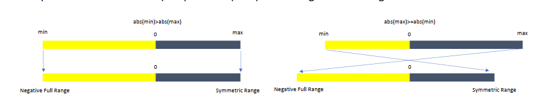

**AutoRound** [version 0.4](https://github.com/intel/auto-round) is set for release, introducing major updates to
support Vision-Language Models (VLMs). During this process, we've gathered insights from quantizing various models.
While the scope of quantization has been somewhat limited, the following tips may still prove useful as a reference.

For environment configuration and setup options, please refer to the [Environment Variables Guide](./environments.md).

### 1. VLM Quantization and Calibration Dataset Choice

**Background:** VLM models typically consist of two main components: a language model and a vision model. This gives
rise to two key questions:

1. Should all the components be quantized?
2. Should the calibration dataset include visual data or not?

**Suggestion: Prioritize quantizing only the language component and using a language-only dataset for calibration.**
AutoRound (>=0.4) will set this as the default model, but users can opt for other configurations for some models.

**Reasoning:**

1. Language Module Dominates, Making It More Cost-Effective to Quantize:

   | Model                         | 16-bit | Language 4-bit |
   | ----------------------------- | ------ | -------------- |
   | Qwen2-VL-7B-Instruct          | 15.6G  | 6.5G           |
   | Phi-3.5-Vision-Instruct       | 7.9G   | 2.8G           |
   | LLaVA-v1.5-7B                 | 12.6G  | 4.3G           |
   | LLaMA-3.2-11B-Vision-Instruct | 20.1G  | 7.9G           |
   | CogVLm2                       | 36.9G  | 17.6G          |

2. Quantizing the Vision Module Leads to Larger Accuracy Loss: We have conducted experiments on Qwen1 and LLaVA, and
   found that quantizing the vision module resulted in considerable accuracy degradation.

3. Quantizing the Vision Module Involves Complex Engineering and Slow Speed:** Quantizing the vision module requires
   calibration with datasets that include image data, though, for some models (such as MLLama), quantizing only the
   language module necessitates the use of image datasets. Additionally, each model has its own set of preprocessing
   methods and organizing image and text data, which are often complex and challenging to handle. Moreover, since these
   models support images of various sizes, each calibration sample must be processed with a batch size of 1 and gradient
   accumulation steps. This approach is not only slow but also prone to precision risks. For more details, you can refer
   to this [blog](https://unsloth.ai/blog/gradient). We've incorporated fixes based on their approach in AutoRound.

4. Quantizing the Language Module Using Only Text Data for Calibration Yields Similar Results to Using Image-Enhanced
   Datasets:** In most models, calibrating with text-only datasets produces results comparable to using datasets with
   images.

### 2. Symmetric vs. Asymmetric Quantization

**Background:** It is generally understood that asymmetric quantization offers better precision than symmetric
quantization. However, it comes with a performance trade-off, . Additionally, in weight quantization scenarios,
symmetric quantization can benefit from the kernel like the Marlin kernel, offering further performance improvements.
Therefore, the choice between symmetric and asymmetric quantization is often challenging.

**Suggestion:** **We recommend using full-range symmetric quantization**. AutoRound (>=0.3.1) has already set this as
the default.

**Reasoning:**

**To my beset knowledge, full-range symmetric quantization was first introduced by the LlamaCPP community.** Based on our experiments, its precision is comparable to
asymmetric quantization, and it outperforms other symmetric quantization variants, particularly in low-bit scenarios like
2-bit quantization.

**Average accuracy across 10 tasks:**

| Model W2G32                | gptq_sym | asym       | full_range_sym |
|----------------------------|----------|------------|----------------|
| Meta-Llama-3.1-8B-Instruct | 0.4500   | 0.52802    | **0.5381**     |
| Qwen2-7B                   | 0.5229   | **0.5559** | 0.5486         |

| Model W4G128               | asym       | full_range_sym |
|----------------------------|------------|----------------|
| Meta-Llama-3.1-8B-Instruct | 0.6342     | **0.6370**     |
| Qwen2-7B                   | 0.6143     | **0.6167**     |
| Mistral-7B-Instruct-v0.2   | 0.6606     | **0.6635**     |
| Phi-3-mini-4k-instruct     | **0.6475** | 0.6432         |

**Further Explanation:**  One key benefit is its broader mapping range. For instance, in 2-bit quantization, the range
extends from -2 to 2, which is eventually clipped to the range (-2, 1). This is similar to the behavior of data types
like NF4 or FP4, where sampling density is higher in lower value ranges and lower in higher ranges, compared to
traditional symmetric quantization that maps values to (-1, 1). Additionally, full-range symmetric quantization does not
suffer from rounding losses at the zero point (zp), as there is no zero-point offset (zp) to deal with. Thanks Luo Yu
for kind discussion.

### 3. Should the LM-head Be Quantized?

**Background:** With the development of large language models (LLMs), the vocabulary size used in model has increased
significantly, resulting in a larger proportion of parameters allocated to the LM-head. However, quantizing the LM-head
could lead to some accuracy loss, so the question is whether it should be quantized.

**Suggestion:** **It can be used for models with 7B to 14B parameters.** In AutoRound, you can directly
use `auto-round --model xxx --quant_lm_head`.

**Reasoning:** For models with 7B or more parameters, quantizing the LM-head has minimal impact on accuracy, and it
offers a reasonable compression rate for the model. But we do find that lm-head quantization could bring large accuracy
drop of IFEVAL task for Qwen2.5-14B-Instruct, so you may need a verification for you model.

| GLM4-chat Metric                           | BF16   | INT4 (6.4G) | INT4-quantized-LM-head (5.5G) |
|--------------------------------------------|--------|-------------|-------------------------------|
| Avg (16 tasks)                             | 0.6260 | 0.6230      | 0.6204                        |
| Leaderboard MMLU Pro 5-shot                | 0.3678 | 0.3616      | 0.3610                        |
| Leaderboard IFEVAL inst-level strict acc   | 0.5504 | 0.5600      | 0.5588                        |
| Leaderboard IFEVAL prompt-level strict acc | 0.4067 | 0.4233      | 0.4067                        |
| CMMLU                                      | 0.7213 | 0.7137      | 0.7086                        |
| CEVAL-valid                                | 0.7065 | 0.7058      | 0.6909                        |
| GSM8K 5-shot strict match                  | 0.7794 | 0.7597      | 0.7589                        |

| Qwen2.5-7b-Instruct Metric                 | BF16   | INT4 (5.3G) | INT4 LM-head (4.5G) |
|--------------------------------------------|--------|-------------|---------------------|
| Avg (16 tasks)                             | 0.6649 | 0.6586      | 0.6577              |
| Leaderboard MMLU Pro 5 shots               | 0.4458 | 0.4436      | 0.4384              |
| Leaderboard IFEVAL inst-level strict acc   | 0.6859 | 0.6715      | 0.6595              |
| Leaderboard IFEVAL prompt-level strict acc | 0.5730 | 0.5508      | 0.5379              |
| MMLU                                       | 0.7174 | 0.7147      | 0.7145              |
| CMMLU                                      | 0.8028 | 0.7888      | 0.7888              |
| CEVAL-valid                                | 0.7935 | 0.7838      | 0.7741              |
| GSM8K 5 shots                              | 0.7665 | 0.7544      | 0.8006              |

------

### 4. Be Cautious of Overflow Caused by Chat Templates

**Background:** When quantizing some instruction-based models, we observed that the accuracy was fine when measured
with `lm-eval-harness`. However, when running with the chat template, the results were poor, with outputs like "!!!!".
Upon investigation, we discovered that intermediate results in the quantized model were causing INF values. This happens
because many of the quantization kernels are in FP16, while the latest models typically use BF16, which has a
significantly larger representable range than FP16. For instance, we observed the following:

- Qwen2-57B-A14B-Instruct `model.layers.3.mlp.shared_expert.down_proj` goes from 30464 (without chat template) to
  48128 (with chat template)
- Qwen2.5-32B-Instruct`model.layers.5.mlp.down_proj` goes from 5952 (without chat template) to 14,000 (with chat
  template)

Although these values fall within the FP16 range, during INT4 tuning, weight adjustments and matrix multiplication could
cause the outputs to become excessively large. Even when a fake QDQ model is fine, issues could still occur when running
with the INT4 kernel.

**Suggestion: It is recommended not to quantize layers with large output values**. In AutoRound (>=0.4), you can
use `--fp_layers "xxx,xxx"` to exclude these layers.

**Reasoning**:  While adjusting the quantization configuration (symmetric/asymmetric) or using `clamp_to_range` may
provide some benefit, configuration tuning can be tedious, and `clamp_to_range` is not always effective. Therefore, it
is often better to revert to the original precision for these layers (and potentially their neighboring layers), as the
number of outlier layers is typically small.

------

### 5. Be Cautious of Underflow Caused by Quantization Scales

**Background:** When quantizing LLaMA 3.1 70B, we found that the accuracy was unstable across tasks—some tasks performed
very well, while others performed poorly

**Suggestion:** **clip the scale with a small threshold, such as 1e-5**, this has been set as the default in AutoRound

**Reasoning**: As mentioned earlier, since CUDA kernels are typically in FP16, the quantization scale is also converted
to FP16. However, the precision of small numbers in FP16 is low, which makes it important to apply a protection to the
low scale to avoid accuracy instability.

------

### 6. Model Data Type for Quantization

**Background:** Most modern models are in BF16, while many INT4 kernels support FP16. The question is whether to cast
the data type before or after quantization.

**Suggestion:** Follow the kernel and cast the model to FP16 before quantization. In AutoRound, you can
use `--model_dtype "fp16"`.

**Reasoning:** We found that this approach resulted in better accuracy for smaller models.

### **7. Better Use `torch.compile`**

**Suggestion: Use `torch.compile` if possible, but be aware that it may throw exceptions for some models, especially
with lower versions of PyTorch**. Starting from PyTorch 2.6, we have set using `torch.compile` as the default.

**Reasoning:**  `torch.compile` is useful to reduce tuning cost. Thanks Liu Yi for kind discussion.

| Torch version/Config W4G128 | 3B        | 8B         | 14B        | 70B         | 8X7B       |
|-----------------------------|-----------|------------|------------|-------------|------------|
| 2.6 with torch compile      | 7min 10GB | 12min 18GB | 23min 22GB | 120min 42GB | 28min 46GB |
| 2.5 w/o torch compile       | 8min 10GB | 16min 20GB | 30min 25GB | 140min 49GB | 50min 49GB |

### 8. Evaluation Tasks

**Suggestions:**

1. **Better not rely solely on PPL (Perplexity) for evaluation.**
2. **Incorporate tasks that use chat templates for instruct/chat models.**

**Reasoning:**

1. PPL is sensitive to outliers, as discussed in our paper. This can skew evaluation results, especially when extreme
   values are present.
2. PPL tends to overfit when the same dataset is used for calibrations, as demonstrated by multiple studies
3. To some extent, PPL is NOT "lower is better"
4. Using chat templates for evaluation (as mentioned in Tip 4) can enhance the severity of model activations, offering a
   more rigorous test for instruction-following and chat models.