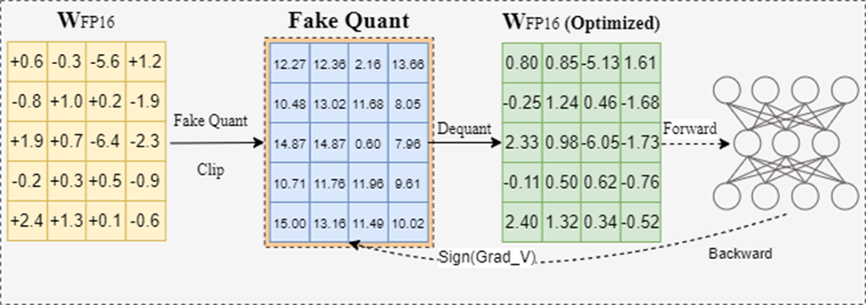

## Fast tuning LayerNorm and Linear bias via fake quantization without rounding

**Personal view by Wenhua, welcome to discuss**

**Performance is poor in most scenarios, so it is not recommended for use at this time.**

Recent studies have found that tuning LayerNorm and bias through optimizer like Adam can lead to better results, especially for low-bit quantization such as 2-bit. However, I personally do not favor the use of Adam for this purpose, as detailed in the following section, and introduce an alternative way, detailed in the last section.

### Why not using Adam

#### Reason1 hard to tune the learning rate and steps

Since Adam adaptively tunes the step size based on the gradient and its square, the learning rate often needs adjustment for different models, different quantization bits, or both, as observed in most papers. I hypothesize that this tuning requirement arises because most papers report results for only a limited range of model families, while many new models continually emerge. Despite my experience in this domain, I still find it challenging to tune the learning rate beyond using grid search. I believe many users encounter the same issue.

#### Reason2 Prone to overfitting

Since Adam adapts the step size with each iteration, it is difficult to control the changes in parameters, leading to significant deviations from the original model's weights in some scenarios. However, we only use hundreds or thousands of samples to fine-tune a low-bit model, whereas the original model is trained on a large corpus and specialized datasets (e.g., instruction datasets). Consequently, even if the low-bit tuned model performs well on some language-modeling tasks, it may lose other compatibility as the deviations increase.

### Our way

**An overview of our method**

We limit the tuned parameters in a quantization space, expressed as:
$$
W' = s*clip(W/s+zp,N,M)
$$
where 𝑠 is the quantization scale, predefined by 𝑊 and hyperparameters such as bits.

To tune the W', following Signround, we add a trainable parameter V in the range [-0.5, 0.5], which can be easily tuned by SignSGD.

$$
W' = s*clip(W/s+zp+v,N,M)
$$

An important note: We remove the rounding to reduce unnecessary rounding loss, as the final weights of LayerNorm and bias are typically kept at 16-bit precision in most cases.

**Result at W2G32**

the tuning of layer normalization and Linear bias are fake quantized at W4G-1.

 Average accuracies of HellaSwag, WinoGrand, PIQA and LAMBADA, higher is better.

|           | OPT125m    | OPT1.3B    | OPT2.7B    | OPT6.7B    | LLaMAV2-7b | LLaMAV3-8B-Instruct |
| --------- | ---------- | ---------- | ---------- | ---------- | ---------- | ------------------- |
| SignRound | 0.3978     | 0.5094     | 0.5267     | 0.3681     | 0.6267     | 0.5890              |
| Ours      | **0.4077** | **0.5151** | **0.5596** | **0.3887** | **0.6315** | **0.5949**          |

